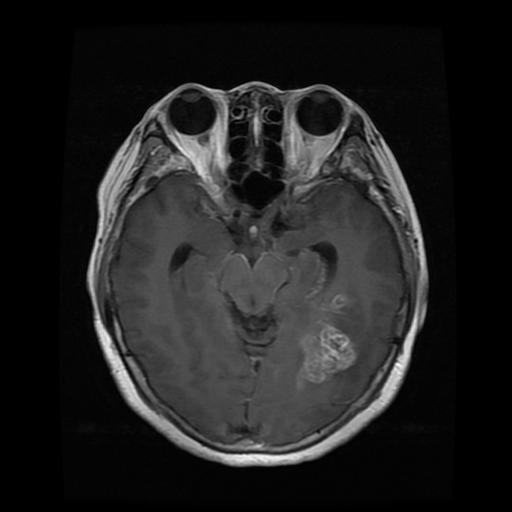
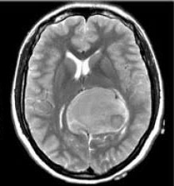
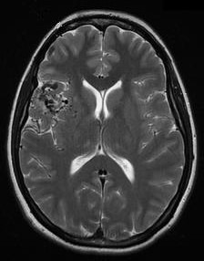
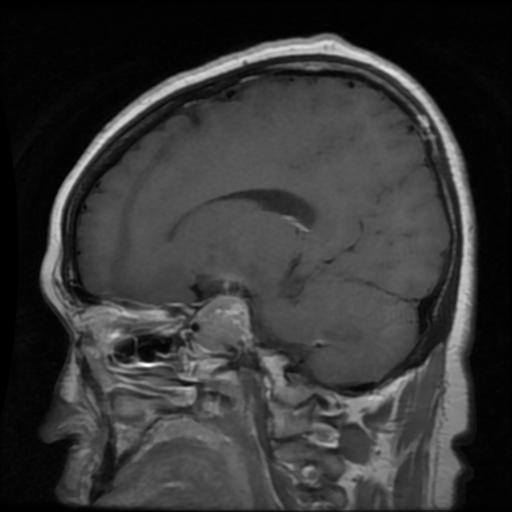

# 🧠 Brain Cancer Prediction with Deep Learning

A deep learning-based project that uses MRI images to classify brain scans into one of four categories:
- **Glioma Tumor**
- **Meningioma Tumor**
- **Pituitary Tumor**
- **No Tumor (Healthy)**

It includes a trained model, prediction scripts, and a responsive **Flask web application** deployed on [Render](https://brain-cancer-prediction-td8j.onrender.com/).

---

## 📸 Sample Output
<table>
    <tr>
        <th>Glioma Tumor</th>
        <th>Meningioma Tumor</th>
        <th>Pituitary Tumor</th>
        <th>No Tumor (Healthy)</th>
    </tr>
    <tr>
        <td align="center">
            <br/>
            <sub><b>Prediction:</b> Glioma Tumor</sub>
        </td>
        <td align="center">
            <br/>
            <sub><b>Prediction:</b> Meningioma Tumor</sub>
        </td>
        <td align="center">
            <br/>
            <sub><b>Prediction:</b> No Tumor</sub>
        </td>
        <td align="center">
            <br/>
            <sub><b>Prediction:</b> Pituitary Tumor</sub>
        </td>
    </tr>
</table>

---

## 🗂 Project Structure

```
Brain-Cancer-Prediction/
├── app.py                   # Flask app (local deployment)
├── app_r.py                 # Flask app (usinfg TFLite)
├── Models/
│   ├── Brain_cancer_model.h5      # Keras model
│   └── Brain_cancer_model.tflite  # Converted TFLite model
├── templates/               # HTML templates
├── static/                  # CSS, JS, image uploads
├── scripts.js               # Frontend interactivity
├── render.yaml              # Render deployment config
├── requirements.txt         # Python dependencies
├── brain_cancer_code.py     # Training script
├── brain_cancer_predict.py  # Local prediction test script
└── README.md
```

---

## 🚀 Demo (Live on Render)

> 🔗 [Live App](https://brain-cancer-prediction-td8j.onrender.com/) 

Upload a brain MRI image and receive a class prediction with a medical-style explanation.

---

## 📊 Dataset

The dataset is structured as follows:

```
Dataset/
├── Training/
├── Testing/
└── Predict/
```

MRI scans are sorted into 4 classes in each folder except the `Predict` folder.


---

## 🧠 Model Architecture

- Base Model: `EfficientNetB0`
- Input Shape: `150x150x3`
- Output: Softmax classification (4 classes)
- Converted to `.tflite` for lightweight inference

---

## 🔧 Installation (Local)

```bash
git clone https://github.com/Wills17/Brain-Cancer-Prediction.git
cd Brain-Cancer-Prediction
pip install -r requirements.txt
python app.py
```

Then open: [http://127.0.0.1:5000](http://127.0.0.1:5000)

---

## 📦 Requirements

```
flask
tflite-runtime
numpy<2.0
pillow
opencv-python-headless
```

---

## ✅ Features

- Drag & drop image uploads
- Instant AI predictions
- Theme toggle (light/dark)
- Downloadable diagnosis report
- Clean, responsive UI

---

## ⚠ Disclaimer

> This is a research-based prototype. It is not a replacement for professional medical diagnosis. Always consult a medical professional for health-related decisions.

---

## 👨‍💻 Author

**Odunayo Williams**    
GitHub: [@Wills17](https://github.com/Wills17)